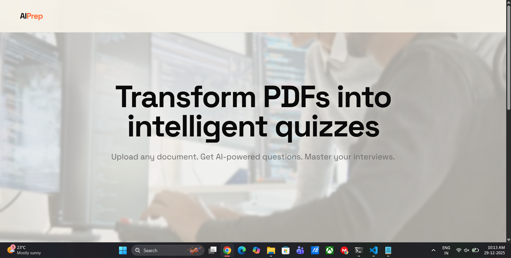
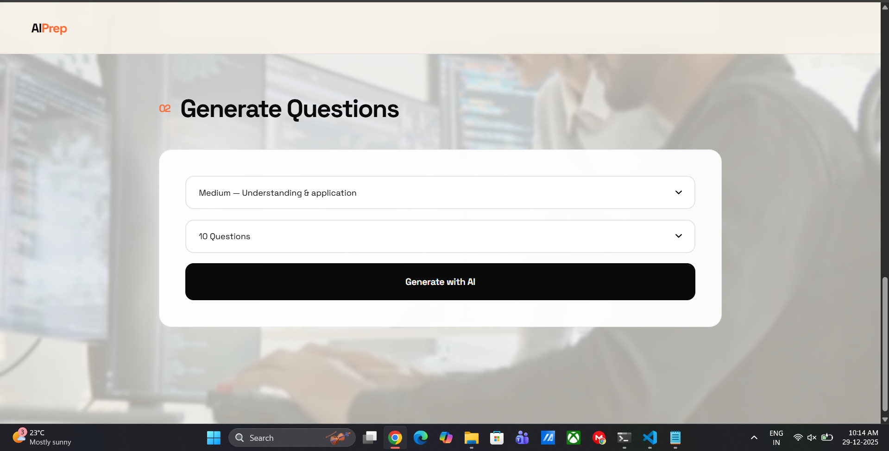
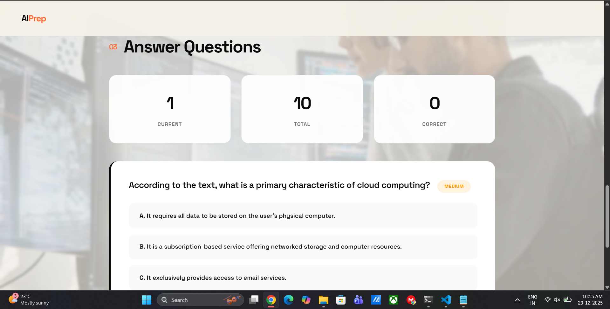
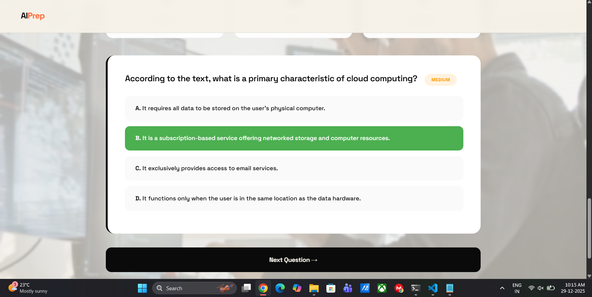
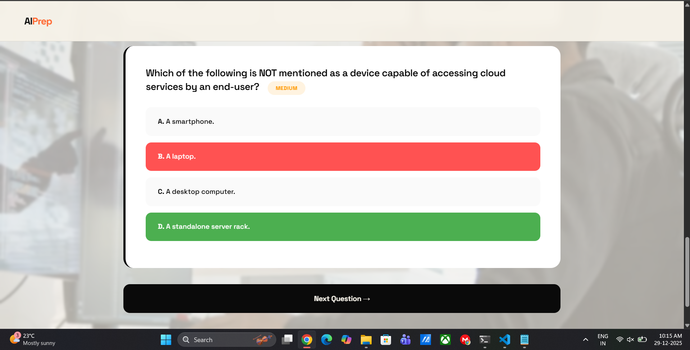
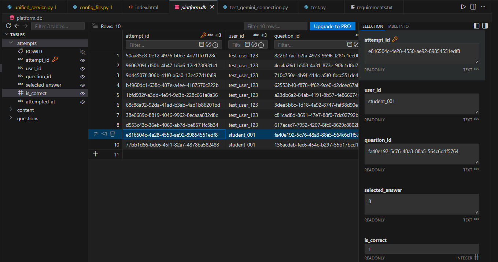

# 🚀 AI Study Prep Platform

Transform your study materials into intelligent, AI-powered quizzes. Upload PDFs, generate questions using Google Gemini AI, and ace your interviews.


---

## ✨ Features

- 📄 **PDF Processing** - Upload and extract text from any PDF document
- 🤖 **AI-Powered Questions** - Generate high-quality MCQs using Google Gemini AI
- 🎯 **Adaptive Difficulty** - Easy, Medium, and Hard question levels
- 📊 **Progress Tracking** - Real-time scoring and performance analytics
- 💾 **Persistent Storage** - All data saved in SQLite database
- 🎨 **Modern UI** - Clean, professional design inspired by contemporary web aesthetics
- ⚡ **Fast & Efficient** - Optimized for quick generation and smooth user experience

---

## 🖼️ Screenshots

---

## 🖼️ Screenshots

### Landing Page

*Clean, professional landing page with video background and bold typography*

### PDF Upload

*Intuitive drag-and-drop interface for uploading study materials*

### AI Question Generation

*Select difficulty level and number of questions to generate*

### Interactive Quiz



*AI-powered multiple choice questions with instant feedback*

### Real-time Progress

*Track your performance with live statistics*


---
```

## 🛠️ Tech Stack

### Backend
- **Python 3.8+** - Core programming language
- **Flask 3.0** - Web framework
- **Google Gemini AI 2.5** - Question generation
- **PyMuPDF** - PDF text extraction
- **SQLite** - Database

### Frontend
- **HTML5/CSS3** - Modern web standards
- **Vanilla JavaScript** - No framework dependencies
- **Space Grotesk Font** - Clean, geometric typography
- **Responsive Design** - Mobile-friendly interface

---

## 📋 Prerequisites

- Python 3.8 or higher
- Google Gemini API Key (free tier available)
- Modern web browser (Chrome, Firefox, Safari, Edge)

---

## ⚙️ Installation

### 1. Clone the Repository
```bash
git clone https://github.com/atharva723/AI_Study_Prep_Platform_using_gemini_api.git
cd AI_Study_Prep_Platform_using_gemini_api
```

### 2. Install Dependencies
```bash
pip install -r requirements.txt
```

**Required packages:**
```
Flask==3.0.0
flask-cors==4.0.0
PyMuPDF==1.23.8
Werkzeug==3.0.1
google-generativeai==0.3.1
```

### 3. Configure API Key

**⚠️ NEVER hardcode API keys in source code!**

**Option A: Environment Variable (Quick)**
```bash
# Windows PowerShell
$env:GEMINI_API_KEY="your-api-key-here"
python unified_service_gemini.py

# Mac/Linux
export GEMINI_API_KEY="your-api-key-here"
python unified_service_gemini.py
```

**Option B: .env File (Recommended)**
```bash
# 1. Install python-dotenv
pip install python-dotenv

# 2. Create .env file
echo "GEMINI_API_KEY=your-api-key-here" > .env

# 3. Run the app
python unified_service_gemini.py
```

**Get your free API key:** https://makersuite.google.com/app/apikey

**📖 Detailed setup guide:** See [ENV_SETUP.md](ENV_SETUP.md)

### 4. Run the Application
```bash
python unified_service_gemini.py
```

Server starts at: `http://localhost:5000`

### 5. Open the Interface
Open `index.html` in your browser

---

## 🚀 Quick Start Guide

### Step 1: Upload PDF
1. Enter your name or student ID
2. Drag and drop a PDF or click to browse
3. Click "Process Document"

### Step 2: Generate Questions
1. Select difficulty level (Easy/Medium/Hard)
2. Choose number of questions (5-20)
3. Click "Generate with AI"

### Step 3: Take Quiz
1. Read each question carefully
2. Select your answer
3. Click "Submit Answer"
4. Review correct answer
5. Continue to next question

### Step 4: View Results
- See your final score
- Review performance metrics
- Start a new quiz anytime

---

## 📁 Project Structure

```
ai-interview-prep/
│
├── unified_service_gemini.py    # Main Flask backend service
├── index.html  # User interface
├── config.py                    # API key configuration
├── requirements.txt             # Python dependencies
├── README.md                    # Project documentation
│
├── uploads/                     # PDF storage (auto-created)
├── platform.db                  # SQLite database (auto-created)
│
└── videos/                      # Optional video backgrounds
    └── hero-background.mp4
```

---

## 🔧 Configuration

### Difficulty Levels

**Easy**
- Basic definitions and concepts
- Straightforward recall questions
- Foundational knowledge

**Medium** (Default)
- Understanding and application
- Connecting concepts
- Moderate complexity

**Hard**
- Advanced analysis and synthesis
- Deep conceptual understanding
- Challenging scenarios

### Question Count
- Minimum: 5 questions
- Maximum: 20 questions
- Recommended: 10 questions

### File Limits
- Max PDF size: 10MB
- Text length: Unlimited
- Supported format: PDF only

---

## 🎨 Customization

### Colors (CSS Variables)
```css
:root {
    --cream: #F5F1E8;      /* Background */
    --black: #0A0A0A;      /* Text */
    --gray: #6B6B6B;       /* Secondary text */
    --accent: #FF6B35;     /* Accent color */
    --green: #4CAF50;      /* Success */
    --red: #FF5252;        /* Error */
}
```

### Video Background
Add your video to `/videos/` folder and update HTML:
```html
<source src="videos/your-video.mp4" type="video/mp4">
```

---

## 🔌 API Endpoints

### Upload PDF
```
POST /upload
Body: multipart/form-data
  - file: PDF file
  - user_id: string
Response: { content_id, page_count, text_length }
```

### Generate Questions
```
POST /generate
Body: { content_id, difficulty, count }
Response: { generated_count, question_ids }
```

### Get Quiz
```
GET /quiz?content_id=xxx&difficulty=medium&count=10
Response: { questions: [...] }
```

### Submit Answer
```
POST /submit
Body: { user_id, question_id, selected_answer }
Response: { is_correct, correct_answer }
```

### Health Check
```
GET /health
Response: { status: "healthy", gemini: "enabled" }
```

---

## 📊 Database Schema

### Content Table
```sql
content_id TEXT PRIMARY KEY
user_id TEXT
file_name TEXT
extracted_text TEXT
page_count INTEGER
uploaded_at TEXT
status TEXT
```

### Questions Table
```sql
question_id TEXT PRIMARY KEY
content_id TEXT
difficulty TEXT
question TEXT
option_a, option_b, option_c, option_d TEXT
correct_answer TEXT
created_at TEXT
```

### Attempts Table
```sql
attempt_id TEXT PRIMARY KEY
user_id TEXT
question_id TEXT
selected_answer TEXT
is_correct INTEGER
attempted_at TEXT
```

---

## 🐛 Troubleshooting

### Issue: "Gemini API not configured"
**Solution:** 
- Ensure `config.py` exists with valid API key
- Or set `GEMINI_API_KEY` environment variable

### Issue: "Content not found"
**Solution:**
- Upload PDF first before generating questions
- Check if PDF was processed successfully

### Issue: "Failed to generate questions"
**Solution:**
- Verify API key is valid
- Check internet connection
- Ensure PDF has sufficient text content (100+ chars)

### Issue: Port 5000 already in use
**Solution:**
```python
# Change port in unified_service_gemini.py (last line)
app.run(host='0.0.0.0', port=5001, debug=True)
```

### Issue: Video not displaying
**Solution:**
- Check video file path is correct
- Ensure video is in MP4 format
- Verify file size is under 10MB

---

## 🔒 Security Considerations

### Production Deployment

1. **Never commit API keys**
   - Add `config.py` to `.gitignore`
   - Use environment variables

2. **Enable HTTPS**
   - Use SSL certificates
   - Enforce secure connections

3. **Add Authentication**
   - Implement JWT tokens
   - Secure API endpoints

4. **Rate Limiting**
   - Limit API calls per user
   - Prevent abuse

5. **Input Validation**
   - Sanitize file uploads
   - Validate user inputs

---

## 🚀 Deployment

### Local Development
```bash
python unified_service_gemini.py
```

### Production (Gunicorn)
```bash
pip install gunicorn
gunicorn -w 4 -b 0.0.0.0:5000 unified_service_gemini:app
```

### Docker
```dockerfile
FROM python:3.9-slim
WORKDIR /app
COPY requirements.txt .
RUN pip install -r requirements.txt
COPY . .
CMD ["python", "unified_service_gemini.py"]
```

### Cloud Platforms
- **Heroku**: Use `Procfile`
- **AWS**: Deploy on EC2 or Elastic Beanstalk
- **Google Cloud**: Use App Engine or Cloud Run
- **Azure**: Use App Service

---

## 📈 Performance

### Benchmarks
- PDF Upload: ~2-5 seconds
- Text Extraction: ~1-3 seconds  
- Question Generation (10 questions): ~10-15 seconds
- Quiz Loading: <1 second
- Answer Submission: <500ms

### Optimization Tips
- Compress PDFs before upload
- Limit question count for faster generation
- Enable caching for repeated queries
- Use CDN for static assets

---

## 🤝 Contributing

Contributions are welcome! Please follow these steps:

1. Fork the repository
2. Create a feature branch (`git checkout -b feature/AmazingFeature`)
3. Commit changes (`git commit -m 'Add AmazingFeature'`)
4. Push to branch (`git push origin feature/AmazingFeature`)
5. Open a Pull Request

### Coding Standards
- Follow PEP 8 for Python code
- Use meaningful variable names
- Add comments for complex logic
- Write unit tests for new features

---

## 🗺️ Roadmap

### Version 2.0 (Planned)
- [ ] User authentication system
- [ ] Question explanations
- [ ] Multiple file format support (DOCX, TXT)
- [ ] Export results as PDF
- [ ] Question difficulty auto-adjustment
- [ ] Topic categorization
- [ ] Study schedule recommendations

### Version 3.0 (Future)
- [ ] Mobile app (React Native)
- [ ] Collaborative study rooms
- [ ] Spaced repetition algorithm
- [ ] Voice-based quizzes
- [ ] Integration with Google Classroom
- [ ] Advanced analytics dashboard
- [ ] Multi-language support

---

## 📝 License

This project is licensed under the MIT License.

```
MIT License

Copyright (c) 2024 [Your Name]

Permission is hereby granted, free of charge, to any person obtaining a copy
of this software and associated documentation files (the "Software"), to deal
in the Software without restriction, including without limitation the rights
to use, copy, modify, merge, publish, distribute, sublicense, and/or sell
copies of the Software, and to permit persons to whom the Software is
furnished to do so, subject to the following conditions:

The above copyright notice and this permission notice shall be included in all
copies or substantial portions of the Software.

THE SOFTWARE IS PROVIDED "AS IS", WITHOUT WARRANTY OF ANY KIND, EXPRESS OR
IMPLIED, INCLUDING BUT NOT LIMITED TO THE WARRANTIES OF MERCHANTABILITY,
FITNESS FOR A PARTICULAR PURPOSE AND NONINFRINGEMENT. IN NO EVENT SHALL THE
AUTHORS OR COPYRIGHT HOLDERS BE LIABLE FOR ANY CLAIM, DAMAGES OR OTHER
LIABILITY, WHETHER IN AN ACTION OF CONTRACT, TORT OR OTHERWISE, ARISING FROM,
OUT OF OR IN CONNECTION WITH THE SOFTWARE OR THE USE OR OTHER DEALINGS IN THE
SOFTWARE.
```

---

## 👨‍💻 Author

**Atharva Jadhav**
- GitHub: [@yourusername](https://github.com/yourusername)
- LinkedIn: [Your LinkedIn](https://linkedin.com/in/yourprofile)
- Email: your.email@example.com

---

## 🙏 Acknowledgments

- **Google Gemini AI** - For powerful question generation
- **Flask Community** - For excellent web framework
- **PyMuPDF** - For reliable PDF processing
- **Pexels/Pixabay** - For free stock videos
- **Space Grotesk** - For beautiful typography

---

## ⭐ Show Your Support

If this project helped you, please give it a ⭐ on GitHub!

---

## 📚 Additional Resources

- [Google Gemini API Documentation](https://ai.google.dev/docs)
- [Flask Documentation](https://flask.palletsprojects.com/)
- [PyMuPDF Documentation](https://pymupdf.readthedocs.io/)

---

**Built with ❤️ for students and interview preparation**

*Last updated: December 2024*
